# Introduction
The purpose of this document is to describe different strategies on how to use IMF attributes. In other words, we would like to answer questions like *"I have this terminal with maximum weight 4 kilo. How should I express this as an IMF attribute?*

One would think that assigning an attribute to something would be easy, but IMF is a complex framework. It's intended use, regarding attributes, is therefore subject to some uncertainty. The goal of this document is to highlight that uncertainty by exemplifying the various ways in which the IMF manual can be interpreted. The goal is to discuss the pros and cons of the different strategies, so that the industry can make a clear decision on how IMF attributes should be used.

This document starts with a brief summary of the information provided about IMF attributes in the IMF manual.  In the following chapters to main strategies are discussed, **attributes as an object** and **attributes as a predicate**, respectively. The most likely interpretation of the IMF manual v. 2.1 seem to favour the first strategy, and three variations are presented. IDO, on the other hand, appears to support both strategies, but are discussed as one under the predicate strategy. Finally, a second **attributes as a predicate** approach is discussed. This is based on the IMF, but has arisen as a suggestion to reduce the complexity for the developers who set out to describe their functions and products.      
# IMF Background
The IMF manual describes an attribute in the following way:

*An [Attribute] describes a quality, property or characteristic of a resource by setting a [predicate], a [value] and optionally a [unit of measure]. An [Attribute] may be qualified by [Attribute Qualifier]s*

The manual also provide the illustration and shacl rule below.

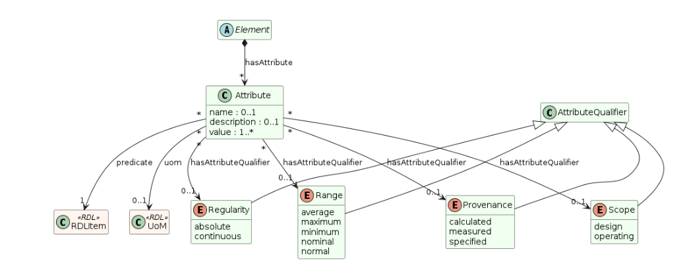

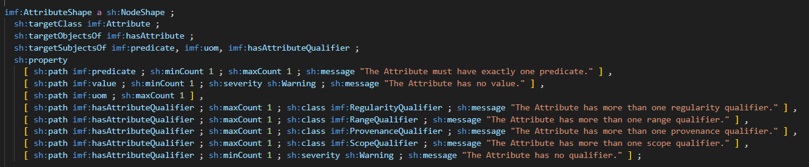

Furthermore, the manual states that for instance a terminal can have multiple attributes with the same quality, like Voltage. These attributes can then be classified with datum classes to separate the value. One of them can be *Maximum Design Voltage* and the other can be *Normal Operating Voltage*. Finally the attribute can be given a value and a unit of measure can be selected. 

The IMF manual advocates flexibility when it comes to what information that should be added at type level and what should be added during instantiation, i.e. usage. This flexibility comes with a cost. It becomes more unclear how the framework is intended used, and the uses have to handle more complexity.

The next chapter discusses various interpretations of how the IMF manual intent the **attributes used as object** to be used.
# Attributes used as Object
The IMF manual specifies that attributes should be used as objects. An `Element` subject and an `Attribute` object are related with the `imf:hasAttribute` predicate. A typical triple stating that something has an attribute will therefore look like the following:

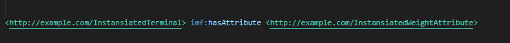

An instantiated `Terminal`, i.e. a specific individual of a type of terminal and aspect, is related to an instantiated `Attribute`. When the particular terminal is created an individual, representing the attribute, should also be created to hold the information about the attribute. The creation of the attribute instance, or individual, is the foundation for the **attributes used as object** strategy and various ways to do this are discussed in the following.
## Fully specified attribute type
The following shacl specifies a **maximum operating continuous measured weight attribute type**. The type is fully specified, i.e. all values that can be assigned at a type level are assigned at type level. 

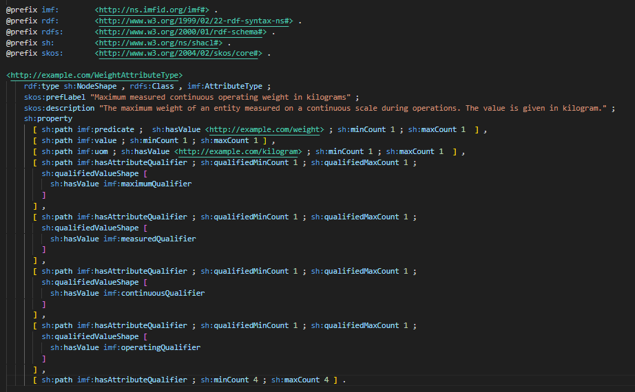

To instantiate the **maximum operating continuous measured weight attribute type** the following information must be provided: 
- one `imf:predicate` with value `<http://example.com/weight>`
- one and only one `imf:value` (the IMF manual accepts multiple values)
- one `imf:uom` with value `<http://example.com/kilogram`>
- four `imf:hasAttributeQualifier` with values
	- `imf:maximumQualifier`
	- `imf:measuredQualifier`
	- `imf:continuousQualifier`
	- `imf:operatingQualifier`

Labels and descriptions are included as nice to have. The instantiation will look something like this:

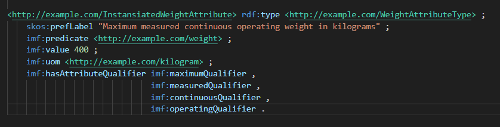

The positive thing with this approach is that the semantics of the attribute is completely given by the attribute type. Two parties downloading the attribute type from PCA will have the exact same understanding of what this attribute type is. 

The downside is that the attribute type must be instantiated every time the attribute is used. In this way, a lot of redundant information (the properties of the attribute type) is stored over and over again.
## Partially specified attribute
The previous example where fully specified, while this example puts less information on the attribute type allowing more flexibility during the instantiation. The IMF manual appears to allow a lot of flexibility regarding attributes, but it is a bit unclear whether this is on the type level or at a combined type - instantiation level. We believe it is the latter, which is the approach taken in this example.

To instantiate the **maximum operating weight attribute type**, given below, the following information must be provided: 
- one `imf:predicate` with value `<http://example.com/weight>`
- one and only one `imf:value` (the IMF manual accepts multiple values)
- zero or one `imf:uom`
- two or three `imf:hasAttributeQualifier` with values from the following qualifier classes
	- `imf:RangeQualifier
	- `imf:ScopeQualifier
	- `imf:RegularityQualifier`
Note that there should be zero members from the last qualifier class.

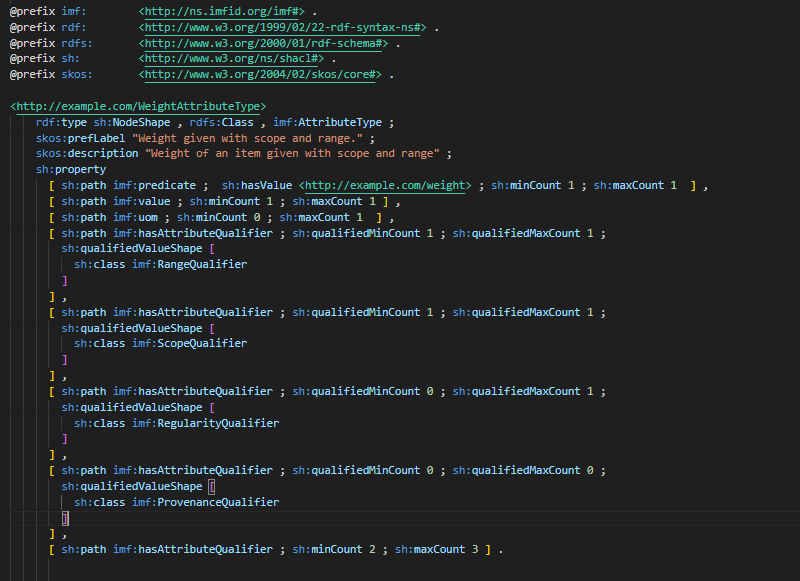

An instantiation of this attribute type can look like the following:

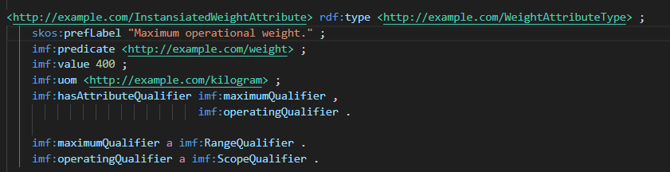

The shacl attribute type described by the shacl shape above is less constrained then the first one. This allows the same type to be instantiated multiple times using the same type, and separate them during instantiation. This is indicated above by the difference in `skos:preflabel` between the type and the instantiation. For the type we can only say that we expect a range and a scope for the weight, but the instantiation specifies that this is a maximum operating value.

Note that the type declarations of `maximumQualifier` and `operatingQualifier` must be part of the instance data for the shacl shape to validate.

The added flexibility greatly reduces both the number of attribute types as well as the amount of redundant data stored during instantiation. However, the semantics of the attribute type is less clearly defined, and complexity is added during both instantiation and later use of the data. 
## Generic attribute
The first example had all the information at the type level. We can go to the other endpoint and say that all the information should be added at the instantiation time. This basically mean that we have an attribute template where the user can fill in the necessary information. If all values can be set, including the `imf:predicate` property then we only have one generic attribute template. 

However, according to the the IMF manual *an attribute should have a specific quality. The quality is provided as part of the IMF Type definition*. In the following example the `imf:predicate` is therefore considered as a necessary requirement.

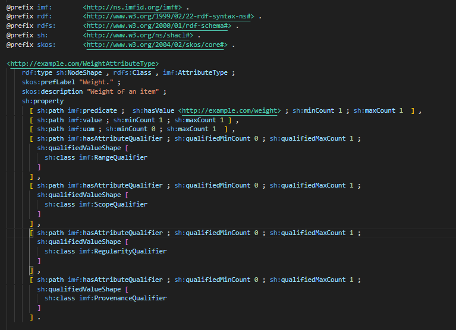

To instantiate the **weight attribute type**, given above, the following information must be provided: 
- one `imf:predicate` with value `<http://example.com/weight>`
- one and only one `imf:value` (the IMF manual accepts multiple values)

The units of measure and the qualifiers are all optional. The minimal instantiation become: 

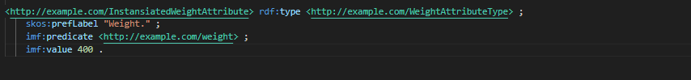

As in all the examples, labels are added as nice to have. The shacl shape for this attribute type is now so flexible that it will also validate the instantiations of the previous two examples (as long as the members of the qualifier classes are part of the dataset).

The only attribute that are needed now are core physical properties, like *pressure*, *thickness* and *mass*. A template is given for how more precise attributes can be built, like *maximum operating pressure in barg*. 

When an attribute is strongly specified we still store the same information over and over again. Not only that, but the task of ensuring that the semantics are correct is moved from the modelling phase and over to the users. Not only do they have to instantiate the attribute correctly, but they also need elaborate strategies to compare whether to attributes are the same or not. In the first example it can be assumed that if the same attribute is used several places, the meaning is the same. In this case, the entire underlying structure of the attribute must be evaluated.  
# Attributes used as Predicate
All the attributes in the previous chapter are intended to be used as an object together with the `imf:hasAttribute` predicate. In this chapter, we look at strategies where the attributes themselves are used as predicate, i.e. take the place of `imf:hasAttribute`.
## Attribute as IDO 'shortcuts'
The qualifier model used in IMF are based on similar concepts in IDO. IDO support in other words the attributes as objects strategy, but it also provide a way where attributes can be used as predicates. This is commonly referred to as the *shortcuts* way.   

The illustration below is the [Uom modelling pattern](https://rds.posccaesar.org/ox-hugo/qualityQuantifiedAs.svg) as described on PCA's webpages. The main part of the figure shows the IDO alternative to the IMF attribute as object strategy. The blue boxes represent instances, and *20L0123* is a pressure quantity. This pressure quantity has again three more specialized pressure datums, like for instance the bottom one, which represent *Absolute maximum operating pressure datum*. This datum is again split in two, one property for the actual datum value and one for the unit of measure.

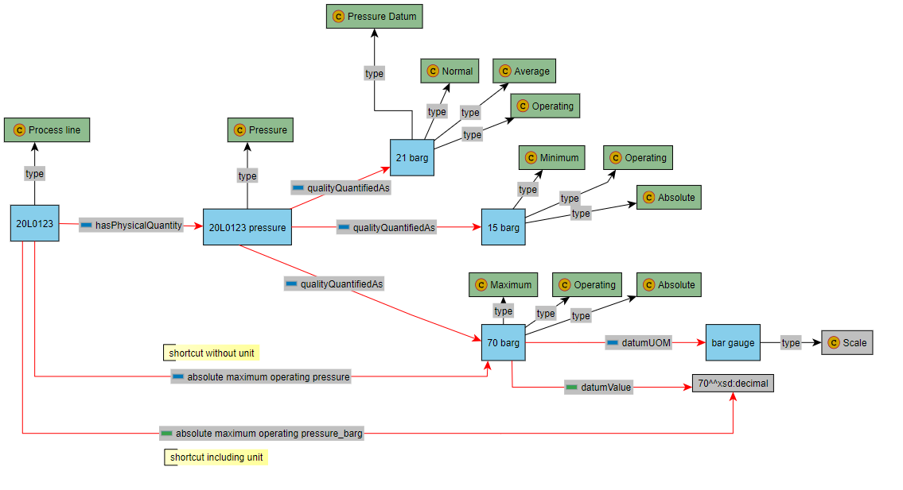

However, the illustration also have two predicates highlighted with yellow annotations. The one at the bottom is called *absolute maximum operating pressure_barg* and points directly from the equipment to the literal value.

Using an attribute from the previous chapter would require the following triple:

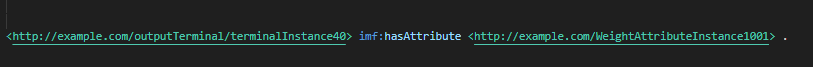

A `Terminal` instance is related to a `Weight Attribute` instance. The attribute instance is the same as in the previous chapter, but included again here for quick reference. This is simply another instance of the attribute type in 

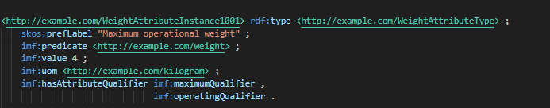

When using an IDO shortcut it will look like this: 

If the `plm:absoluteMaximumOperatingPressure_barg` predicate multiple times it is expected that it means the same. The need for instantiating the attribute and restating its semantics seem to have disappeared and all that is needed is simply a new value.

Note: The namespace *ido* is used for terms that are included in the Industrial Data Ontology. Other terms can for instance exist in a lower level ontology like the *plm* (Product Lifecycle Management). The example uses human-readable names for the plm terms and not their PCA identities. This is done to improve the readability of the example.

The semantics behind the `plm:absoluteMaximumOperatingPressure_barg` predicate must be stated somewhere, and it can be written as:

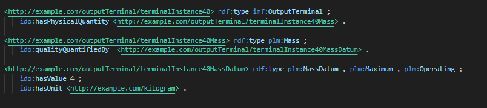

The richer model that carries the semantics of the meaning of the *shortcut* are created during instantiation. The usage of the *shortcut* was easy, but the underlying model must also here be created during instantiation and it is unclear how the shortcut actually relates to the richer model.  

## Attribute as a complex predicate
Prerequisite for the **attribute as an object** strategy is that the attributes are instantiated when they are used, i.e. when we create a terminal that have a maximum weight attribute the attribute must be instantiated. This means that all the complexity of the IMF framework is exposed to all the developers who simply want to describe their equipment using attributes.

The previous *shortcut* example appeared to simplified this. The actual shortcut is easy to use, but doesn't actually exist before the richer model is instantiated. The **attribute a a complex predicate** is a new suggestion that attempts to address the above mentioned issues. It should be noted that it is not an interpretation of the IMF manual, but more a suggestion to how the framework can be simplified. 

Below is a modified version of one of the IMF examples: 

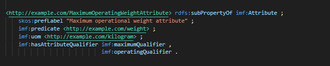

Previously the IMF attribute types where given as shacl and the instantiation of a type looked similar to the example above. However, there are a few key differences. First of all it is no longer and instance of an attribute type, but a subProperty of an `imf:Attribute`. Secondly, it doesn't specify a value. The maximum operating weight attribute can now be used as:

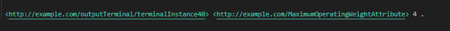

It is a *shortcut* with all the semantics attached. The attribute is used directly without the need to instantiate it, which means that it is easier to use. The need to store redundant information is removed, and there is no longer need for shacl shapes at the attribute level. 

This solution has less flexibility and the number of attributes will be larger than most of the other examples. 
# Summary
This document describes different strategies that can be used to handle IMF attributes. One would think that assigning an attribute to something would be easy, but IMF is a complex framework. It's intended use is therefore subject to some uncertainty. The goal of this document is to highlight that uncertainty as well at its complexity, in an hope that the framework can be simplified. 

The use of shacl shapes, the need to instantiate attributes before use, and the semantical flexibility the instantiation process gives, are all contributing to increasing the complexity that developers must deal with. There are also more tangible challenges like storing redundant information over and over again.

The last strategy, , is provided as a suggestion to how these issues can be solved. 